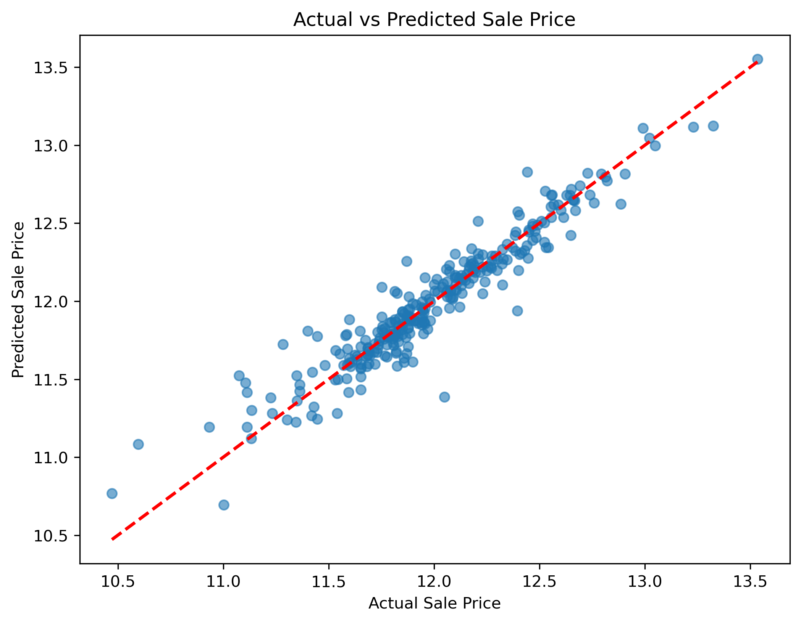

# 🏠 House Price Prediction

This project builds a machine learning model to predict house sale prices based on various property features, helping buyers and sellers estimate property values accurately.

---

## 📁 Dataset

- **Source:** House price data with multiple numerical and categorical features such as size, bedrooms, neighborhood, year built, and more.  
- Contains detailed property attributes and sale prices.

---

## 🌍 Content Overview

- Data preprocessing including missing value imputation and categorical encoding  
- Training a Linear Regression model to predict sale prices  
- Evaluating model performance with RMSE metric  
- Visualizing actual vs predicted sale prices  
- Deploying the trained model as a web application using Streamlit

---

## 📈 Visualizations

### 1. Actual vs Predicted Sale Prices  


---

## 🧠 Machine Learning

- **Model:** Linear Regression  
- **Preprocessing:** SimpleImputer for missing values, OneHotEncoder for categorical features  
- **Evaluation Metric:** Root Mean Squared Error (RMSE)

---

## 🛠️ Tools Used

- Python (Pandas, NumPy, Matplotlib)  
- scikit-learn (LinearRegression, SimpleImputer, OneHotEncoder)  
- Jupyter Notebook  
- Streamlit (for web app)

---

## 🌐 Web App

An interactive web application is built using **Streamlit** to allow users to input property details and get an estimated house price prediction in real-time.

### Features:

- User-friendly form to input features like square footage, neighborhood, etc.  
- Displays predicted house price instantly  
- Integrated with the trained ML model

---

## 🚀 Deployment

You can deploy the Streamlit app locally or on a cloud platform like **Streamlit Community Cloud**, **Render**, or **Heroku**.

### Run the app locally:

```bash
streamlit run app.py

## 🚀 How to Run locally

1. Clone this repository 
2.pip install -r requirements.txt
3.streamlit run app.py
---

Let me know if you'd like help writing the `app.py` file or setting up the deployment to Streamlit Cloud!
## 📌 Author

Made with ❤️ by [Farah]